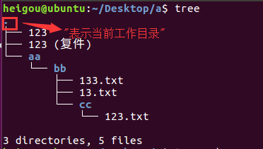
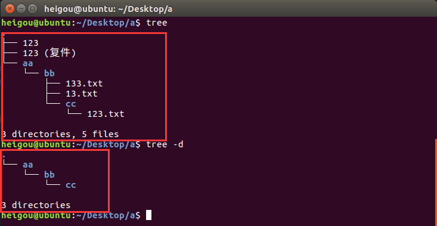
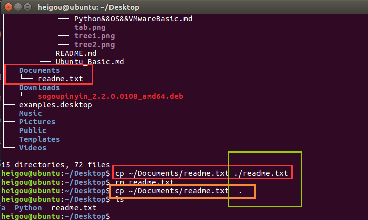
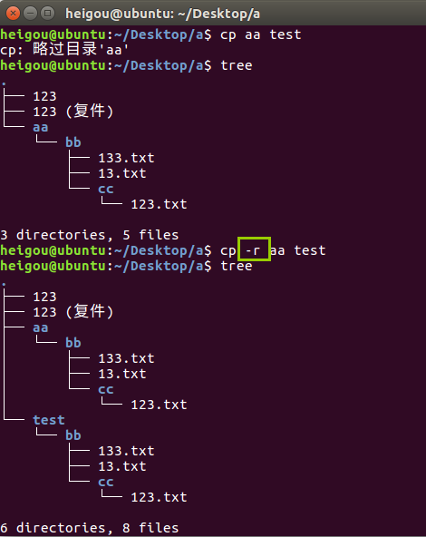
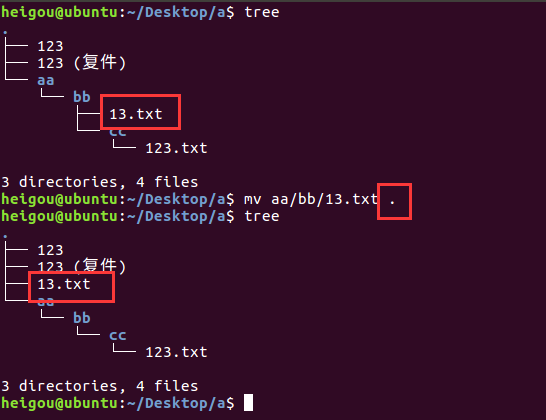
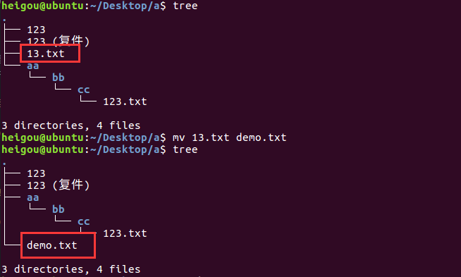
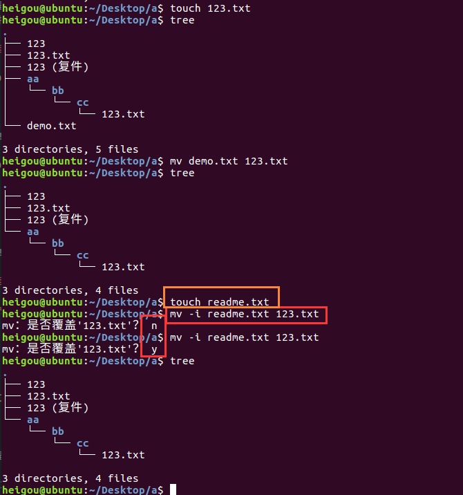
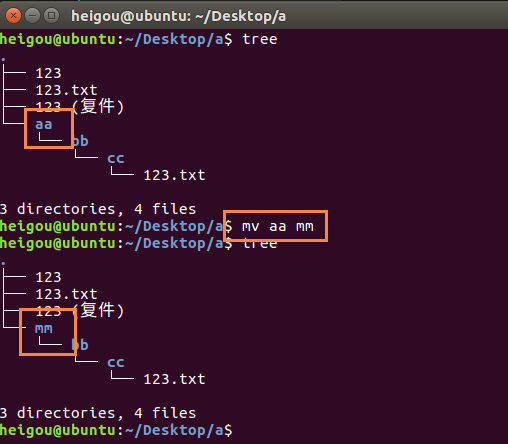

# 04.拷贝和移动文件
|序号|命令|对应英文|作用|
|:---|:----|:---|:---|
|01   |tree [目录名]   |tree   | 以树状图列出文件目录结构  |
|02   |cp 源文件 目标文件   |copy   |复制文件或者目录   |
|03   |mv 源文件 目标文件   |move   |移动文件或者目录/文件或者目录重命名   |

## 4.1 tree
 **tree命令可以以树状图列出文件目录结构**

|选择|含义|
|:---|:---|
|-d   |只显示目录   |

**单独的tree命令可以显示当前目录下的文件和文件夹的树形结构，以及文件和文件夹的个数**

**tree -d 只显示目录**

## 4.2 cp

cp 命令的功能是将给出的 **文件** 或者 **目录** 中，相当于DOS下的copy命令

**将某文件夹下的文件复制到另一个地方，可以有两种方式:**

  （1）cp ~/Documents/readme.txt ./readme.txt ——对复制后的文件重新命名

  （2）cp ~/Documents/readme.txt  . ——直接将文件复制的目标文件夹，不用重命名

|选项|含义|
|:---|:---|
|-i   |覆盖文件前提示   |
|-r   |若给出源文件是目录文件，则cp将递归复制该目录下的所有子目录和文件，目标文件必须为一个目录名   |

### cp -i 源文件 目标文件

（1）使用cp -i ~/Documents/readme.txt .，**选择不覆盖**

（2）使用cp -i ~/Documents/readme.txt .，**选择覆盖**

### cp -r 源文件 目标文件

**使用cp复制文件夹时，也需要使用“-r”**

## 4.3 mv

**mv 命令可以移动文件或目录，也可以给文件或目录重命名**

|选项|含义|
|:---|:---|
|-i   |覆盖文件前提示  |

（1）把bb文件夹下的13.txt移动到当前文件夹下

（2）对文件进行重命名，且配合"-i"使用

（3）对文件夹进行重命名

