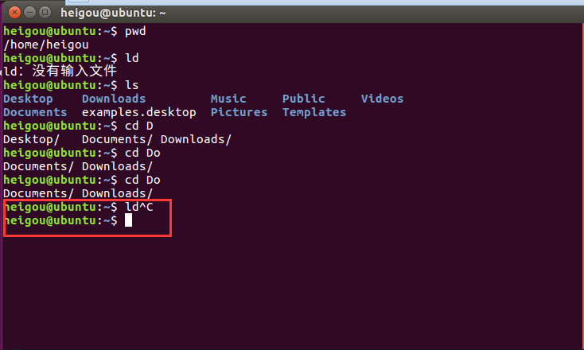
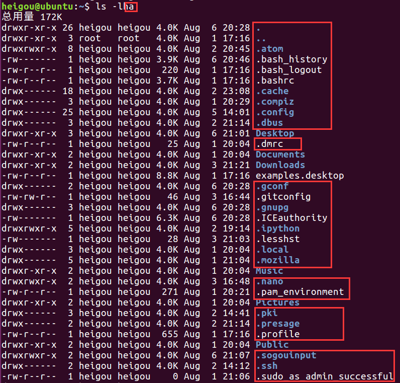
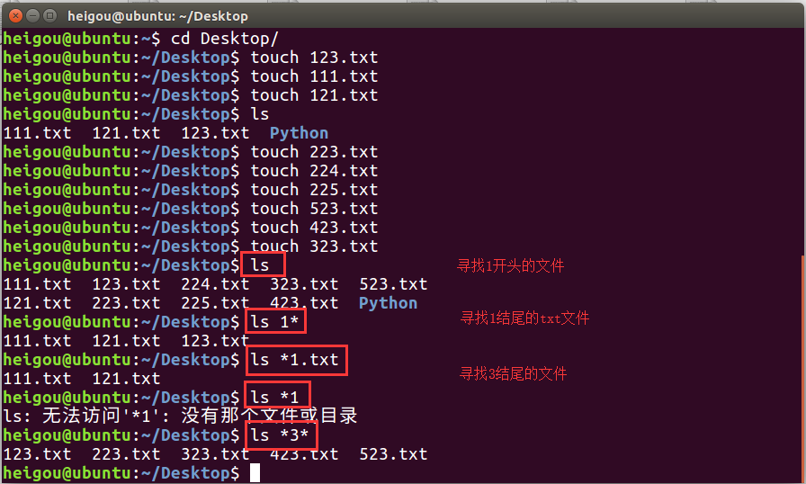

# 文件和目录常用命令

## 终端实用技巧

### 在敲出文件/目录/命令的前几个字母之后，按下tab键

（1）如果输入没有歧义，系统会自动补全

（2）如果还存在其他文件/目录/命令，再按一下tab键，系统会提示可能存在的命令

### 曾经使用过的命令

（1）按上/下光标键可以在曾经使用过的命令之间来回切换

（2）如果想要退出选择，并且不想执行当前选中的命令，可以按ctrl+c

## ls命令说明

**ls是英文单词list的简写，起功能为列出目录的内容，是用户最常用的目录之一，类似于dos下的dir命令**

### Linux下文件和目录的特点

（1）Linux文件或者目录名称最长可以有256个字符

（2）以 . 开头的文件为隐藏文件，需要用-a参数才能显示

（3）. 代表当前目录， .. 代表上一级目录

## ls常用选项

|参数|含义|
|:---|:---|
|-a   | 显示指定目录下所有子目录与文件，包括隐藏文件  |
|-l   |以列表方式显示文件的详细信息   |
|-h   |配合-l 以人性化的方式显示文件大小   |

### ls -l

### ls -h和 ls -l的配合

**-h必须要搭配-l使用，至于顺序的问题，是无所谓的；-h，-l，-a搭配使用，可以体现全部的效果**

## ls和通配符的使用

|通配符|含义|
|:---|:---|
|*   |代表任意个数字符,包括0个   |
|？   |代表任意一个字符，至少一个   |
|[ ]   |表示可以匹配字符组中的任意一个   |
|[abc]   |匹配a、b、c中的任意一个   |
|[a-f]   |匹配从a到f范围内的任意一个   |

#### *	代表任意个数字符,包括0个

#### ？	代表任意一个字符，至少一个

