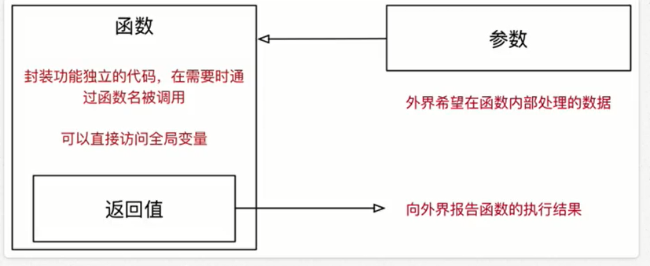
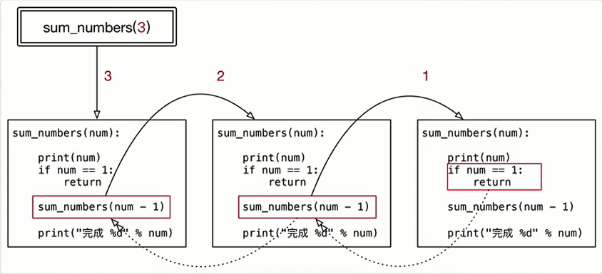

<!-- TOC depthFrom:1 depthTo:6 withLinks:1 updateOnSave:1 orderedList:0 -->

- [函数参数和返回值等等](#函数参数和返回值等等)
	- [函数参数和返回值的作用](#函数参数和返回值的作用)
	- [函数的返回值](#函数的返回值)
	- [面试题 -- 交换两个数字](#面试题-交换两个数字)
	- [函数的参数](#函数的参数)
		- [不可变和可变的参数](#不可变和可变的参数)
	- [面试题 -- +=](#面试题-)
		- [缺省参数](#缺省参数)
		- [多值参数](#多值参数)
	- [函数的递归](#函数的递归)
		- [递归函数的特点](#递归函数的特点)
		- [递归案例 -- 计算数字累加](#递归案例-计算数字累加)

<!-- /TOC -->
# 函数参数和返回值等等
## 函数参数和返回值的作用
函数根据有没有参数 以及有没有返回值，可以相互结合：
1. 无参数，无返回值
2. 无参数，有返回值
3. 有参数，无返回值
4. 有参数，有返回值



> 定义函数，是否接收参数，或者是否返回结果，是根据实际的功能需求来决定的！
1. 如果函数内部处理的数据不确定，就可以将外界的数据以参数传递到内部
2. 如果希望一个函数执行完成后，向外界汇报执行结果，就可以增加函数的返回值

## 函数的返回值
+ 在程序开发中，希望一个函数执行结束后，告诉调用者一个解雇，以便调用者针对具体的结果做后续的处理
+ **返回值** 是函数完成工作后，最后给调用者一个结果
+ 在函数中使用 return 关键之可以返回结果
+ 调用函数一方，可以使用变量来接收函数的返回值

**示例**
+ 假设开发一个函数能够同时返回当前温度和湿度
+ 先返回温度的功能如下：
```python
  def measure():
      """测量温度和湿度"""
      print("开始测量...")
      temp = 10
      wetness = 50
      print("测量结束...")
      return temp
  result = measure()
  print(result)
  # 结果
  开始测量...
  测量结束...
  10
```
+ 利用元组在返回温度的同时，也能够返回湿度
+ 改造如下：
```python
  def measure():
      """测量温度和湿度"""
      print("开始测量...")
      temp = 10
      wetness = 50
      print("测量结束...")
      # 元组-可以包含多个数据，因此可以使用元组让函数一次返回多个值
      # 如果函数返回的类型是元组，小括号可以省略
      # return (temp,wetness)
      return temp,wetness
  result = measure()
  print(result)
  # 结果
  开始测量...
  测量结束...
  (10, 50)
```
```python
  def measure():
      """测量温度和湿度"""
      print("开始测量...")
      temp = 10
      wetness = 50
      print("测量结束...")
      # 元组-可以包含多个数据，因此可以使用元组让函数一次返回多个值
      # 如果函数返回的类型是元组，小括号可以省略
      # return (temp,wetness)
      return temp,wetness
  # 元组
  result = measure()
  print(result)
  # 需要单独处理温度或者湿度 -- 不方便
  print(result[0])
  print(result[1])
  # 如果函数返回的类型是元组，同时希望单独的处理元组中的元素
  # 可以使用多个变量，一次接收函数的返回结果
  # 注意：使用多个变量接收结果时，变量的个数应该和元组中元素的个数保持一致
  gl_temp,gl_wetness = measure()
  print(gl_temp)
  print(gl_wetness)
  # 结果
  开始测量...
  测量结束...
  (10, 50)
  10
  50
  开始测量...
  测量结束...
  10
  50
```
## 面试题 -- 交换两个数字
**题目要求**
1. 有两个整数变量 a = 6，b = 100
2. 不使用其他变量，交换两个变量的值

```python
  a = 6
  b = 99

  # 解法1： 使用其他变量
  # c = a
  # a = b
  # b = c
  # 解法2：不使用其他变量
  # a = a + b
  # b = a - b
  # a = a - b
  # 解法3：Python专有
  # a,b = (b,a)
  # 等号右边是元组，只是把小括号省略了
  a,b = b,a
  print(a)
  print(b)
  # 结果
  99
  6
```
## 函数的参数
### 不可变和可变的参数
> 问题1：在函数内部，针对参数使用赋值语句，会不会影响到调用函数时传递的实参变量？ -- 不会

+ 无论传递的参数是可变还是不可变
  - 只要针对参数使用赋值语句，会在函数内部修改局部变量的引用，不会影响到外部变量的引用

```python
  def demo(num,num_list):
      print("函数内部的代码")

      # 在函数内部，针对参数使用赋值语句,不会修改到外部的实参变量
      num = 100
      num_list = [1,2,3]
      print(num)
      print(num_list)
      print("函数执行完成")


  gl_num = 99
  gl_list = [4,5,6]
  demo(gl_num,gl_list)
  print(gl_num)
  print(gl_list)
  # 结果
  函数内部的代码
  100
  [1, 2, 3]
  函数执行完成
  99
  [4, 5, 6]
```
> 问题2：如果传递的参数是可变类型，在函数的你恶不，使用方法修改了数据的内容，同样会影响到外部的数据

```python
def demo(num_list):
      print("函数内部的代码")
      # 使用方法修改列表的内容
      num_list.append(9)
      print(num_list)
      print("函数执行完成")

  gl_list = [1,2,3]
  demo(gl_list)
  print(gl_list)

  # 结果
  函数内部的代码
  [1, 2, 3, 9]
  函数执行完成
  [1, 2, 3, 9]
```
## 面试题 -- +=
+ 在python中，列表变量调用 += 本质上是在执行列表变量的extend方法，不会修改变量的引用

```python
  def demo(num,num_list):
      print("函数开始")
      # num = num + num
      num += num  # 属于正常的变量赋值类型，会修改变量的引用
      # num_list = num_list + num_list
      # num_list.extend(num_list)由于是调用方法，所以不会修改变量的引用
      # 函数执行结束后，外部数据同样会发生变化
      # num_list += num_list
      print(num)
      print(num_list)
      print("函数完成")

  gl_num = 9
  gl_list = [1,2,3]
  demo(gl_num,gl_list)
  print(gl_num)
  print(gl_list)

  # 结果
  函数开始
  18
  [1, 2, 3, 1, 2, 3]
  函数完成
  9
  [1, 2, 3]
```
### 缺省参数
+ 定义函数时，可以给某个参数指定一个默认值，具有默认值的参数就叫做缺省参数
+ 调用函数时，如果没有传入缺省参数的值，则在函数内部使用定义函数时指定的参数默认值
+ 函数的缺省参数，将常见的值设置为参数的缺省值，从而简化函数的调用
+ 例如：对列表排序的方法

```python
  gl_list = [6,3,9]
  # 默认按照升序排序
  gl_list.sort()
  print(gl_list)
  # 如果需要降序排序，需要执行reverse参数
  gl_list.sort(reverse=True)
  print(gl_list)

  # 结果
  [3, 6, 9]
  [9, 6, 3]
```
**指定函数的缺省值**
+ 在参数后使用赋值语句，可以指定参数的缺省值

```python
  def print_info(name,gender = True):
      """

      :param name: 班上的同学的姓名
      :param gender: True男生 False 女生
      """
      gender_text = "男生"

      if not gender:
          gender_text = "女生"
      print("%s 是 %s" % (name,gender_text))

  # 假设班上的同学，男生居多
  # 提示：在指定缺省参数的默认值时，应该使用最常见的值
  print_info("小明")
  print_info("小美",False)

  # 结果
  小明 是 男生
  小美 是 女生
```
**提示**
1. 缺省参数，需要使用最常见的值作为默认值！
2. 如果一个参数的值不能确定，则不应该设置默认值，具体的数值在调用函数时，由外界传递！

**缺省参数的注意实事项**
**1)缺省参数的定义位置**
+ 必须保证带有默认值的缺省参数，在参数列表末尾
+ 所以，以下定义错误！
```python
def print_info(name,gender=True,title)
```

**2)调用带有多个缺省参数的函数**
+ 在调用函数时，如果有多个缺省参数，需要指定参数名，这样解释器才能够知道参数的对应关系！
```python
  def print_info(name,title="",gender = True):
      """

      :param title: 职位
      :param name: 班上的同学的姓名
      :param gender: True男生 False 女生
      """
      gender_text = "男生"

      if not gender:
          gender_text = "女生"
      print("[%s]%s 是 %s" % (title,name,gender_text))

  # 假设班上的同学，男生居多
  # 提示：在指定缺省参数的默认值时，应该使用最常见的值
  print_info("小明")
  print_info("小美",gender=False)

  # 结果
  []小明 是 男生
  []小美 是 女生
```

### 多值参数
**定义支持多值参数的函数**
+ 有时可能需要一个函数能够处理的参数个数是不确定的，这个时候，就可以使用多值参数
+ python中有两种多值参数：
  - 参数名前增加一个 * 可以接收元组
  - 参数名前增加两个 * 可以接收字典
+ 一般在给多值参数命名时，习惯使用以下两个名字
  - *args -- 存放元组参数，前面有一个 *
  - **kwargs -- 存放字典参数，前面有两个 *
+ args是arguments的缩写，有变量的含义
+ kw是keyword 的缩写，kwargs可以记忆键值对参数

```python
  def demo(num, *nums, **person):
      print(num)
      print(nums)
      print(person)

  demo(1)
  print("多值参数传入：")
  demo(1,2,3,4,5,name="小明")

  # 结果
  1
  ()
  {}
  多值参数传入：
  1
  (2, 3, 4, 5)
  {'name': '小明'}
```
**多值参数案例 -- 计算任意多个**
**需求**
1. 定义一个函数sum_numbers，可以接收任意多个整数
2. 功能要求： 将要传递的所有数字累加并且返回累加结果

```python
  # def sum_numbers(args):
  def sum_numbers(*args):
      num = 0
      print(args)
      # 循环遍历
      for n in args:
          num += n
      return num

  # result = sum_numbers((1,2,3,4,5))
  result = sum_numbers(1,2,3,4,5)
  print(result)

  # 结果
  (1, 2, 3, 4, 5)
  15
```
**元组和字典的拆包**
+ 在调用带有多值参数的函数时，如果希望：
  - 将一个元组变量，直接传递给args
  - 将一个字典变量，直接传递给kwargs
+ 就可以使用拆包，简化参数的传递，拆包方式为：
  - 在元组变量前，增加一个 *
  - 在字典变量前，增加两个 *

```python
  def demo(*args, **kwargs):

      print(args)
      print(kwargs)

  # 元组变量/字典变量
  gl_nums = (1,2,3)
  gl_dict = {"name":"小明","age":18}
  # demo(gl_nums,gl_dict)
  demo(*gl_nums, **gl_dict)
  # demo(1,2,3,name="小明",age=18)

  # 结果
  (1, 2, 3)
  {'name': '小明', 'age': 18}
```

## 函数的递归
> 函数调用自身的编程技巧称为递归

### 递归函数的特点
**特点**
+ 一个函数内部自己调用自己
  - 函数内部可以调用其他函数，在函数内部也可以调用自己

**代码特点**
1. 函数内部的代码是相同的，只是针对参数不同，处理的结果不同
2. 当参数满足一个条件时，函数不再执行
  - 相当重要，被称为递归出口，否则会出现死循环

```python
  def sum_number(num):
      print(num)
      # 递归出口：当参数满足某个条件时，不再执行函数
      if num == 1:
          return
      #自己调用自己
      sum_number(num -1)

  sum_number(3)

  # 结果
  3
  2
  1
```  

**程序执行流程**



### 递归案例 -- 计算数字累加
**需求**
1. 定义一个函数sum_numbers
2. 能够接收一个num的整数参数
3. 计算1+2+...+num 的结果

```python
  # 定义一个函数sum_numbers
  # 能够接收一个num的整数参数
  # 计算1 + 2 + ... +num 的结果

  def sum_numbers(num):
      # 1.出口
      if num == 1:
          return  1
      # 2. 数字的累加num + （1 ... num-1）
      # 假设sum_numbers能够正确的处理 1 ... num -1
      temp = sum_numbers(num - 1)
      return num + temp

  result = sum_numbers(3)
  print(result)

  # 结果
  6
```
**程序执行流程**


