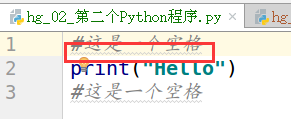
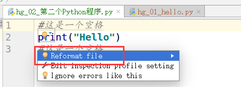
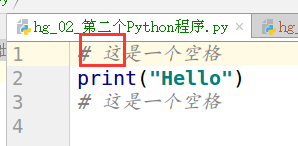
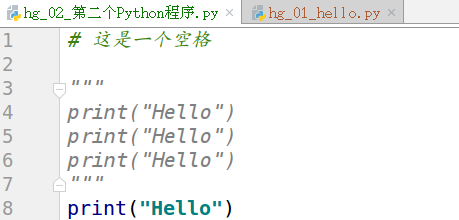

<!-- TOC depthFrom:1 depthTo:6 withLinks:1 updateOnSave:1 orderedList:0 -->

- [执行Python程序的三种方式](#执行python程序的三种方式)
	- [Python解释器 Python/Python3](#python解释器-pythonpython3)
- [使用python 2.x解释器](#使用python-2x解释器)
- [使用python 3.x解释器](#使用python-3x解释器)
	- [交互式运行Python程序](#交互式运行python程序)
	- [Python的IDE -- PyCharm](#python的ide-pycharm)
	- [多文件项目演练](#多文件项目演练)
	- [注释](#注释)
		- [注释的作用](#注释的作用)
		- [单行注释](#单行注释)
		- [多行注释](#多行注释)
		- [关于代码规范](#关于代码规范)
- [算数运算符](#算数运算符)
	- [算数运算符](#算数运算符)
	- [算数运算的优先级](#算数运算的优先级)
	- [程序执行原理](#程序执行原理)
		- [计算机三大件](#计算机三大件)
		- [程序执行原理](#程序执行原理)
			- [Python程序执行原理](#python程序执行原理)
	- [程序的作用](#程序的作用)
		- [思考QQ程序的启动过程](#思考qq程序的启动过程)
- [变量的基本作用](#变量的基本作用)
	- [变量定义](#变量定义)
		- [1）变量演练1 -- IPython](#1变量演练1-ipython)
		- [2）变量演练2 -- PyCharm](#2变量演练2-pycharm)
		- [3）变量演练3 -- 超市买苹果](#3变量演练3-超市买苹果)
	- [关闭标签](#关闭标签)
	- [思考题](#思考题)
	- [变量的类型](#变量的类型)
		- [变量类型演练 -- 个人信息](#变量类型演练-个人信息)
			- [4种数据类型](#4种数据类型)
		- [变量的类型](#变量的类型)
	- [不同类型变量之间的计算](#不同类型变量之间的计算)
	- [变量的输入](#变量的输入)
	- [变量的格式化输出](#变量的格式化输出)

<!-- /TOC -->
# 执行Python程序的三种方式
## Python解释器 Python/Python3
**Python解释器**

```
# 使用python 2.x解释器
$ python xxx.py

#使用python 3.x解释器
$ python3 xxx.py
```
**其他解释器**

**Python解释器** 如今有多个语言的实现，包括：
+ Cpython --官方版本的C语言实现
+ Jpython --可运行在Java品台上
+ IronPython --可以运行在.NET和Mono平台
+ PyPy --Python实现的，支持JIT即时编译

## 交互式运行Python程序
+ 直接在终端中运行解释器，而不输入要执行的文件名
+ 在Python的shell中直接输入Python的代码，会即刻看到程序执行结果

**1）交互式运行的Python优缺点**
+ 优点
  + 适合与学习/验证Python语法或者局部代码
+ 缺点
  + 代码不能保存
  + 不适合运行太大的程序
**2）退出官方解释器**
+ 直接输入exit（）

+ 使用热键退出
在Python解释器中，按热键ctrl+d可以退出解释器

```
heigou@ubuntu:~$ python
Python 2.7.12 (default, Dec  4 2017, 14:50:18)
[GCC 5.4.0 20160609] on linux2
Type "help", "copyright", "credits" or "license" for more information.
>>> 1.01 ** 356
34.546898707112454
>>> exit()
heigou@ubuntu:~$ python3
Python 3.5.2 (default, Nov 23 2017, 16:37:01)
[GCC 5.4.0 20160609] on linux
Type "help", "copyright", "credits" or "license" for more information.
>>>
heigou@ubuntu:~$


```
**3）IPython**
+ IPython中的“I”代表交互interactive

**特点**
+ IPython 是一个Python的交互式shell，比默认的python shell更好用
  + 支持自动补全
  + 自动缩进
  + 支持bash shell命令
  + 内置了许多很有用的功能和函数
+ IPython是基于BSD开发的

**版本**
+ Python 2.x使用的解释器是ipython
+ Python 3.x使用的解释器是ipython3
+ 退出解释器可以有以下两种方式：
  + 直接输入exit
  + 使用热键退出
  在Python解释器中，按热键ctrl+d，Ipython会询问是否退出解释器

  ```
  heigou@ubuntu:~$ ipython
  Python 2.7.12 (default, Dec  4 2017, 14:50:18)
  Type "copyright", "credits" or "license" for more information.

  IPython 2.4.1 -- An enhanced Interactive Python.
  ?         -> Introduction and overview of IPython's features.
  %quickref -> Quick reference.
  help      -> Python's own help system.
  object?   -> Details about 'object', use 'object??' for extra details.

  In [1]:
  Do you really want to exit ([y]/n)? y
  ```

## Python的IDE -- PyCharm
**1)集成开发环境（IDE）**
集成开发环境（IDE，Integrated Development Environment）-- 集成了开发软件需要的所有工具，一般包括以下工具：
+ 图形用户界面
+ 代码编辑器（支持自动补全/自动缩进）
+ 编译器/解释器
+ 调试器（断点/单步执行）
+ .......

**2)PyCharm介绍**
+ PyCharm是Python一款非常优秀的集成开发环境
+ PyCharm除了具有一般IDE所必备的功能补全，还可以在Windows、Linux、macOS下使用
+ PyCharm适合开发大型工具
  + 一个项目通常包含很多源文件
  + 每个源文件的代码行数是有限的，通常在几百行之内
  + 每个源文件各司其职，共同完成复杂的业务功能

**3）PyCharm快速体验**


+ 文件导航区 能够浏览/定位/打开 项目文件
+ 文件编辑区 能够编辑当前打开的文件
+ 控制台区域能够：
  + 输出程序执行内容
  + 跟踪调试代码的执行
+ 右上角的工具栏能够 **执行（SHFIT +F10）** / **调试（SHIFT+F9）** 代码

## 多文件项目演练

+ 清空运行结果


## 注释
### 注释的作用
> 使用自己熟悉的语言，在程序中对某些代码进行标记说明，增强程序的可读性

### 单行注释
+ 格式不整齐，需要在“#”后再添加空格



+ 整体“#”后加空格





单步执行代码，验证“#”的作用，Python默认其后为说明性文字，不需要执行

+ 可在代码后面增加注释，需要在代码后添加空格，也需要在“#”后再添加空格

### 多行注释
```
"""
print("Hello")
print("Hello")
print("Hello")
"""
print("Hello")
```



### 关于代码规范
+ Python官方提供有一系列PEP（Python Enhancement Proposals）文档
+ 其中第8篇文档专门针对Python的代码格式建议
+ [官方文档地址](https://www.python.org/dev/peps/)
+ [谷歌文档](http://zh-google-styleguide.readthedocs.io/en/latest/google-python-styleguide/python_style_rules/)

# 算数运算符
## 算数运算符
+ 算数运算符是运算符的一种
+ 是完成基本的算术运算使用的符号，处理四则运算
|运算符|描述|
|:---|:---|
|+   |加   |   
|-   | 减  |   
|*   | 乘  |   
|/   |  除 |   
|//   | 取整除  |   
|%   |  取余数 |   
|**   |  幂 |   

```
In [6]: 9 // 2
Out[6]: 4

In [7]: 9 % 2
Out[7]: 1
```
在Python中 * 运算符还可以用于字符串，计算结果就是字符串重复指定次数的结果

```
In [10]: "-" * 10
Out[10]: '----------'
```

## 算数运算的优先级
同基础数学方式一样

## 程序执行原理
### 计算机三大件
+ CPU
	+ 中央处理器，是一块超大规模的集成电路
	+ 负责 **处理数据/计算**
+ 内存
	+ **临时** 存储数据（断电之后，数据会消失）
	+ 速度快（CPU直接读取数据）
	+ 空间小（单位价格高）
+ 硬盘（转速）
	+ 永久存储数据
	+ 速度慢
	+ 空间大（单位价格低）
	+ 程序安装在硬盘中

### 程序执行原理


1. 程序运行之前，程序保存在硬盘中
2. 当要运行一个程序时
	+ 操作系统会让CPU把程序复制到内存中
	+ CPU执行内存中的程序代码

> **程序要执行，首先要被加载到内存**

#### Python程序执行原理


1. 操作系统会首先让CPU把Python解释器的程序复制到内存中
2. Python解释器根据语法规则，从上到下让CPU翻译Python程序中的代码
3. CPU负责执行翻译完成的代码

+ 查看Python解释器大小
```
heigou@ubuntu:~/Desktop$ which python ——查看位置
/usr/bin/python
heigou@ubuntu:~/Desktop$ ls -lh /usr/bin/python
lrwxrwxrwx 1 root root 9 Aug  2 01:02 /usr/bin/python -> python2.7
heigou@ubuntu:~/Desktop$ ls -lh /usr/bin/python2.7 ——查看Python2.7大小
-rwxr-xr-x 1 root root 3.4M Dec  5  2017 /usr/bin/python2.7
```
+ python和python2.7实则建立软连接
> 提示：建立软连接的目的，是为了方便使用者不用记住使用的解释器具体是哪一个具体版本

## 程序的作用
> 程序是用来处理数据的
+ 新闻软件提供的新闻内容、评论......是数据
+ 地图类软件提供的是地图信息、定位信息、车辆信息......是数据
+ ......

### 思考QQ程序的启动过程
	1. QQ在运行之前，程序保存在硬盘中
	1. 运行之后，QQ程序就会被加载到内容中

# 变量的基本作用
> 程序用来处理数据，变量用来存储数据

## 变量定义
+ 在python中，每个变量在使用前必须赋值，变量赋值以后该变量才会被创建
+ 等号（=）用来给变量赋值
	+ = 左边变量名
	+ = 右边是存储在变量中的值

### 1）变量演练1 -- IPython

```
In [1]: qq_num = "111111"
In [2]: qq_num
Out[2]: '111111'
In [3]: qq_password = "222222"
In [4]: qq
qq_num       qq_password  
In [4]: qq_password
Out[4]: '222222'
In [5]: qq_num
Out[5]: '111111'
```
### 2）变量演练2 -- PyCharm
```
1.定义一个变量记录QQ号码
qq_num = "1111111"
2.定义一个变量记录QQ密码
qq_password = "222222"
如果希望通过解释器的方式，输出变量的内容，需要使用print函数
print(qq_num)
print(qq_password)
```

### 3）变量演练3 -- 超市买苹果

> + 可以用其他变量的计算结果来定义变量
> + 定义变量之后，后续则可以直接使用

```
	#1.定义苹果的单价
	price  = 8.5
	#2.定义购买重量
	weight = 7.5
	#计算金额
	money = price * weight
	print(money)
```
## 关闭标签


## 思考题

```
	# 1.定义苹果的单价
	price  = 8.5
	# 2.定义购买重量
	weight = 7.5
	# 计算金额
	money = price * weight
	# 4.只要买苹果，就返回5块钱
	money = money - 5
	print(money)
```
+ 变量名只有在第一次出现才是定义变量
+ 变量名再次出现，不是定义变量，而是直接使用之前定义过的变量
+ 在程序开发中，可以修改之前定义变量中保存的值，变量中的值是可以变的

## 变量的类型
+ 在内存中创建一个变量，包括：
	1. 变量的名称
	2. 变量保存的数据
	3. 变量存储数据的类型
	4. 变量的地址（标示）

### 变量类型演练 -- 个人信息
**需求**
+ 定义变量保存小明个人信息
+ 姓名：小明
+ 性别：男
+ 年龄：18
+ 身高：175cm
+ 体重：75kg

```
"""
姓名：小明
性别：男
年龄：18
身高：175cm
体重：75kg
"""
	#在运行的时候，Python解释器会根据赋值语句等号右侧的数据
	#自行推导出变量中保存数据的准确类型
	#str表示是一个字符串类型
	name = "xm" # python中字符串需要双引号
	# int表示一个字符串类型
	age = 18
	# bool表示一个布尔类型，真是True或者假是False
	gender = True # yes
	# float表示是一个小数类型、浮点数
	height = 1.75
	weight = 75.0
	print(name)
```


### 4种数据类型
+ str -- 字符串
+ bool -- 布尔（真假）
+ int -- 整数
+ float -- 浮点数（小数）

### 变量的类型
+ 在Python中定义变量是不需要指定类型
+ 数据类型可以分为数字型和非数字型
+ 数字型
	+ 整型（int）
	+ 浮点型（float）
	+ 布尔型（bool）
		+ 真 True 非 0 数 -- **非零即真**
		+ 假 False 0
	+ 复数型
		+ 主要用于科学计算，例如：平面场、波动问题等等
+ 非数字型
	+ 字符串
	+ 列表
	+ 元组
	+ 字典
> 提示：在Python2.x中，整数根据保存数值的长度还分为：
> + int （整数）
> + long（长整数）
```
  #  ipython
  In [1]: 2 ** 32
  Out[1]: 4294967296
  In [2]: type(2 ** 32)
  Out[2]: int
  In [3]: type(2 **64)
  Out[3]: long
  In [4]: 2 ** 64
  Out[4]: 18446744073709551616L
  #ipython3
  In [1]: type(2 ** 32)
  Out[1]: int
  In [2]: type(2 **64)
  Out[2]: int
  In [3]: 2 ** 64
  Out[3]: 18446744073709551616
```
+ 使用type函数可以查看一个变量的类型
```shell
In [1]: name = "xm"
In [2]: type(name)
Out[2]: str
In [3]: age = 18
In [4]: type(age)
Out[4]: int
In [5]: gender = True
In [6]: type(gender)
Out[6]: bool
```
## 不同类型变量之间的计算
**1）数字变量之间可以直接计算**
+ 在Python中，两个数字型变量之间可以直接进行算数运算
+ 如果变量是bool型，在计算时
	+ True对应的数字是 1
	+ False对应的数字是 0
演练
```
In [1]: i = 10
In [2]: f = 10.5
In [3]: b = True
In [4]: i + f
Out[4]: 20.5
In [5]: i + b
Out[5]: 11
In [6]: f - b
Out[6]: 9.5
In [7]: i * b
Out[7]: 10
```
**2)字符串变量之间使用 + 拼接字符串**
+ 在Python中，字符串之间可以使用 + 拼接生成新的字符串
```
  #  ipython3
  In [1]: first_name = "三"
  In [2]: last_name = "张"
  In [3]: first_name + last_name
  Out[3]: '三张'
  In [4]: last_name + first_name
  Out[4]: '张三'
```
**3）字符串变量可以和整数使用*重复拼接相同的字符串**
```
n [5]: first_name * 10
Out[5]: '三三三三三三三三三三'
In [6]: last_name * 10
Out[6]: '张张张张张张张张张张'
In [7]: (last_name + first_name) * 10
Out[7]: '张三张三张三张三张三张三张三张三张三张三'
```
**4）数字型变量和字符串之间不能进行其他计算**
```
In [8]: first_name + 10
TypeError                                 Traceback (most recent call last)
<ipython-input-8-7799d2023e21> in <module>()
----> 1 first_name + 10
TypeError: Can't convert 'int' object to str implicitly
In [9]: first_name + "10" —— 此时10已经变成了字符串
Out[9]: '三10'
```
## 变量的输入
+ 所谓输入，是用 **代码** 获取用户通过 **键盘** 输入的信息
+ 在Python中，如果要获取用户在键盘上的输入信息，需要使用到 input 函数

**1）关于函数**
+ 一个提前准备好的功能（别人或者自己写的代码），可以直接使用，而不用关心内部的细节
+ 目前已经学习过的函数

|函数|说明|
|:---|:---|
|print(x)   |将x输出到控制台   |
|type(x)   |查看x的变量类型   |

**2)input函数实现键盘输入**
+ 在Python中可以使用input函数从键盘等待用户的输入
+ 用户输入的任何内容Python都认为是一个字符串（str）
+ 语法如下：
  字符串变量 = input（“提示信息：”）
```
  # ipython3
  In [1]: input()
  111
  Out[1]: '111'
  In [2]: input("请输入学号")
  请输入学号111111
  Out[2]: '111111'
  In [3]: password = input("请输入学号")
  请输入学号111111
  In [4]: print(password)
  111111
  In [5]: type(password)
  Out[5]: str
  In [6]: age = input("请输入您的年龄")
  请输入您的年龄18
  In [7]: type(age)
  Out[7]: str
```
**3）类型转换函数**

|函数|说明|
|:---|:---|
|int(x)   |将x转换为一个整数   |
|float(x)   |将x转换到一个浮点数   |

**4）买苹果升级版**
**需求**
+ 收银员输入苹果的价格
+ 收银员输入用户购买苹果的重量
+ 计算且输出付款金额
```
  # 1.输入苹果的单价
  price_str = input("苹果的单价:")
  # 2.输入苹果的重量
  weight_str = input("苹果的重量:")
  # 3.计算支付的总金额
  # 注意：两个字符变量之间是不能直接用乘法的
  # money = price_str * weight_str
  # 1>将价格转换成小数
  price = float(price_str)
  # 2>将重量转换成小数
  weight = float(weight_str)
  # 3>用两个小数来计算最终的金额
  money = price * weight
  print(money)
```
**解决定义多变量问题**
```
  # 1. 输入苹果的单价
  price = float(input("苹果的价格"))
  # 2. 输入苹果的重量
  weight = float(input("苹果的重量:"))
  # 3.计算金额
  money = price * weight
  print(money)
```
+ 改进后的好处：
  1.节约空间，只需要为一个变量分配空间
  2.命名方便，不需要为中间变量命名

## 变量的格式化输出

> 苹果单价9.00，购买了5，需要支付45
+ 在Python中可以使用print函数将信息输出到控制台
+ 如果希望输出文字信息的同时，一起输出数据，就需要使用到 **格式化操作符**
+ % 被称为 **格式化操作符** ，专门用于处理字符串中的格式
  + 包含 % 的字符串，被称为格式化字符串
  + % 和不同的字符连用，不同类型的数据需要使用不同格式化字符

|格式化字符|含义|
|:---|:---|
|%s   |字符串   |
|%d   |有符号十进制整数，%06d表示输出的整数显示位数，不足的地方用 0 补全   |
|%f   |浮点数，%.02f表示小数点后只显示两位   |
|%%   |输出%   |

+ 语法格式如下：
  print（”格式化字符串“ % 变量1）
  print（”格式化字符串“ % 变量1，变量2...）
```
  # 定义字符串变量 name， 输出 请多多关照
  name = "小明"
  print("%s,请多多关照"%name)
```
```
  # 定义整数变量std_no,输出 学号 000001
  std_no = 1
  print("学号 %06d"%std_no)
```
```
  # 定义小数price、weight、money，
  # 输出 苹果单价，购买了5，需要支付45
  price = 8.5
  weight = 7.5
  money = price * weight
  # print("苹果单价 %f，购买了 %f，需要支付 %f" % (price,weight,money))
  #苹果单价 8.500000，购买了 7.500000，需要支付 63.750000
  print("苹果单价 %.2f，购买了 %.3f，需要支付 %.4f" % (price,weight,money))
  #苹果单价 8.50，购买了 7.500，需要支付 63.7500
```
```
  # 定义一个小数scale, 输出 数据比例是 10.00%
  scale = 0.25 * 100
  # print("数据比例是 %f%%" %scale)
  # 数据比例是 25.000000%
  print("数据比例是 %.2f%%" %scale)
  # 数据比例是 25.00%
```
