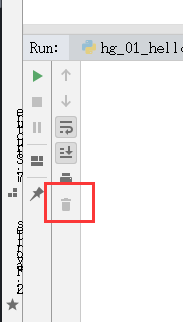
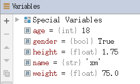

<!-- TOC depthFrom:1 depthTo:6 withLinks:1 updateOnSave:1 orderedList:0 -->

- [执行Python程序的三种方式](#执行python程序的三种方式)
	- [Python解释器 Python/Python3](#python解释器-pythonpython3)
- [使用python 2.x解释器](#使用python-2x解释器)
- [使用python 3.x解释器](#使用python-3x解释器)
	- [交互式运行Python程序](#交互式运行python程序)
	- [Python的IDE -- PyCharm](#python的ide-pycharm)
	- [多文件项目演练](#多文件项目演练)
	- [注释](#注释)
		- [注释的作用](#注释的作用)
		- [单行注释](#单行注释)
		- [多行注释](#多行注释)
		- [关于代码规范](#关于代码规范)
- [算数运算符](#算数运算符)
	- [算数运算符](#算数运算符)
	- [算数运算的优先级](#算数运算的优先级)
	- [程序执行原理](#程序执行原理)
		- [计算机三大件](#计算机三大件)
		- [程序执行原理](#程序执行原理)
			- [Python程序执行原理](#python程序执行原理)
	- [程序的作用](#程序的作用)
		- [思考QQ程序的启动过程](#思考qq程序的启动过程)
- [变量的基本作用](#变量的基本作用)
	- [变量定义](#变量定义)
		- [1）变量演练1 -- IPython](#1变量演练1-ipython)
		- [2）变量演练2 -- PyCharm](#2变量演练2-pycharm)
- [1.定义一个变量记录QQ号码](#1定义一个变量记录qq号码)
- [2.定义一个变量记录QQ密码](#2定义一个变量记录qq密码)
- [如果希望通过解释器的方式，输出变量的内容，需要使用print函数](#如果希望通过解释器的方式输出变量的内容需要使用print函数)
		- [3）变量演练3 -- 超市买苹果](#3变量演练3-超市买苹果)
- [1.定义苹果的单价](#1定义苹果的单价)
- [2.定义购买重量](#2定义购买重量)
- [计算金额](#计算金额)
	- [关闭标签](#关闭标签)
	- [思考题](#思考题)
- [1.定义苹果的单价](#1定义苹果的单价)
- [2.定义购买重量](#2定义购买重量)
- [计算金额](#计算金额)
- [4.只要买苹果，就返回5块钱](#4只要买苹果就返回5块钱)
	- [变量的类型](#变量的类型)
		- [变量类型演练 -- 个人信息](#变量类型演练-个人信息)
- [在运行的时候，Python解释器会根据赋值语句等号右侧的数据](#在运行的时候python解释器会根据赋值语句等号右侧的数据)
- [自行推导出变量中保存数据的准确类型](#自行推导出变量中保存数据的准确类型)
- [str表示是一个字符串类型](#str表示是一个字符串类型)
- [int表示一个字符串类型](#int表示一个字符串类型)
- [bool表示一个布尔类型，真是True或者假是False](#bool表示一个布尔类型真是true或者假是false)
- [float表示是一个小数类型、浮点数](#float表示是一个小数类型浮点数)
			- [4种数据类型](#4种数据类型)

<!-- /TOC -->
# 执行Python程序的三种方式
## Python解释器 Python/Python3
**Python解释器**

```
# 使用python 2.x解释器
$ python xxx.py

#使用python 3.x解释器
$ python3 xxx.py
```
**其他解释器**

**Python解释器** 如今有多个语言的实现，包括：
+ Cpython --官方版本的C语言实现
+ Jpython --可运行在Java品台上
+ IronPython --可以运行在.NET和Mono平台
+ PyPy --Python实现的，支持JIT即时编译

## 交互式运行Python程序
+ 直接在终端中运行解释器，而不输入要执行的文件名
+ 在Python的shell中直接输入Python的代码，会即刻看到程序执行结果

**1）交互式运行的Python优缺点**
+ 优点
  + 适合与学习/验证Python语法或者局部代码
+ 缺点
  + 代码不能保存
  + 不适合运行太大的程序
**2）退出官方解释器**
+ 直接输入exit（）

+ 使用热键退出
在Python解释器中，按热键ctrl+d可以退出解释器

```
heigou@ubuntu:~$ python
Python 2.7.12 (default, Dec  4 2017, 14:50:18)
[GCC 5.4.0 20160609] on linux2
Type "help", "copyright", "credits" or "license" for more information.
>>> 1.01 ** 356
34.546898707112454
>>> exit()
heigou@ubuntu:~$ python3
Python 3.5.2 (default, Nov 23 2017, 16:37:01)
[GCC 5.4.0 20160609] on linux
Type "help", "copyright", "credits" or "license" for more information.
>>>
heigou@ubuntu:~$


```
**3）IPython**
+ IPython中的“I”代表交互interactive

**特点**
+ IPython 是一个Python的交互式shell，比默认的python shell更好用
  + 支持自动补全
  + 自动缩进
  + 支持bash shell命令
  + 内置了许多很有用的功能和函数
+ IPython是基于BSD开发的

**版本**
+ Python 2.x使用的解释器是ipython
+ Python 3.x使用的解释器是ipython3
+ 退出解释器可以有以下两种方式：
  + 直接输入exit
  + 使用热键退出
  在Python解释器中，按热键ctrl+d，Ipython会询问是否退出解释器

  ```
  heigou@ubuntu:~$ ipython
  Python 2.7.12 (default, Dec  4 2017, 14:50:18)
  Type "copyright", "credits" or "license" for more information.

  IPython 2.4.1 -- An enhanced Interactive Python.
  ?         -> Introduction and overview of IPython's features.
  %quickref -> Quick reference.
  help      -> Python's own help system.
  object?   -> Details about 'object', use 'object??' for extra details.

  In [1]:
  Do you really want to exit ([y]/n)? y
  ```

## Python的IDE -- PyCharm
**1)集成开发环境（IDE）**
集成开发环境（IDE，Integrated Development Environment）-- 集成了开发软件需要的所有工具，一般包括以下工具：
+ 图形用户界面
+ 代码编辑器（支持自动补全/自动缩进）
+ 编译器/解释器
+ 调试器（断点/单步执行）
+ .......

**2)PyCharm介绍**
+ PyCharm是Python一款非常优秀的集成开发环境
+ PyCharm除了具有一般IDE所必备的功能补全，还可以在Windows、Linux、macOS下使用
+ PyCharm适合开发大型工具
  + 一个项目通常包含很多源文件
  + 每个源文件的代码行数是有限的，通常在几百行之内
  + 每个源文件各司其职，共同完成复杂的业务功能

**3）PyCharm快速体验**


+ 文件导航区 能够浏览/定位/打开 项目文件
+ 文件编辑区 能够编辑当前打开的文件
+ 控制台区域能够：
  + 输出程序执行内容
  + 跟踪调试代码的执行
+ 右上角的工具栏能够 **执行（SHFIT +F10）** / **调试（SHIFT+F9）** 代码

## 多文件项目演练

+ 清空运行结果



## 注释
### 注释的作用
> 使用自己熟悉的语言，在程序中对某些代码进行标记说明，增强程序的可读性

### 单行注释
+ 格式不整齐，需要在“#”后再添加空格


+ 整体“#”后加空格


单步执行代码，验证“#”的作用，Python默认其后为说明性文字，不需要执行

+ 可在代码后面增加注释，需要在代码后添加空格，也需要在“#”后再添加空格

### 多行注释
```
"""
print("Hello")
print("Hello")
print("Hello")
"""
print("Hello")
```


### 关于代码规范
+ Python官方提供有一系列PEP（Python Enhancement Proposals）文档
+ 其中第8篇文档专门针对Python的代码格式建议
+ [官方文档地址](https://www.python.org/dev/peps/)
+ [谷歌文档](http://zh-google-styleguide.readthedocs.io/en/latest/google-python-styleguide/python_style_rules/)

# 算数运算符
## 算数运算符
+ 算数运算符是运算符的一种
+ 是完成基本的算术运算使用的符号，处理四则运算
|运算符|描述|
|:---|:---|
|+   |加   |   
|-   | 减  |   
|*   | 乘  |   
|/   |  除 |   
|//   | 取整除  |   
|%   |  取余数 |   
|**   |  幂 |   

```
In [6]: 9 // 2
Out[6]: 4

In [7]: 9 % 2
Out[7]: 1
```
在Python中 * 运算符还可以用于字符串，计算结果就是字符串重复指定次数的结果

```
In [10]: "-" * 10
Out[10]: '----------'
```

## 算数运算的优先级
同基础数学方式一样

## 程序执行原理
### 计算机三大件
+ CPU
	+ 中央处理器，是一块超大规模的集成电路
	+ 负责 **处理数据/计算**
+ 内存
	+ **临时** 存储数据（断电之后，数据会消失）
	+ 速度快（CPU直接读取数据）
	+ 空间小（单位价格高）
+ 硬盘（转速）
	+ 永久存储数据
	+ 速度慢
	+ 空间大（单位价格低）
	+ 程序安装在硬盘中

### 程序执行原理


1. 程序运行之前，程序保存在硬盘中
2. 当要运行一个程序时
	+ 操作系统会让CPU把程序复制到内存中
	+ CPU执行内存中的程序代码

> **程序要执行，首先要被加载到内存**

#### Python程序执行原理


1. 操作系统会首先让CPU把Python解释器的程序复制到内存中
2. Python解释器根据语法规则，从上到下让CPU翻译Python程序中的代码
3. CPU负责执行翻译完成的代码

+ 查看Python解释器大小
```
heigou@ubuntu:~/Desktop$ which python ——查看位置
/usr/bin/python
heigou@ubuntu:~/Desktop$ ls -lh /usr/bin/python
lrwxrwxrwx 1 root root 9 Aug  2 01:02 /usr/bin/python -> python2.7
heigou@ubuntu:~/Desktop$ ls -lh /usr/bin/python2.7 ——查看Python2.7大小
-rwxr-xr-x 1 root root 3.4M Dec  5  2017 /usr/bin/python2.7
```
+ python和python2.7实则建立软连接
> 提示：建立软连接的目的，是为了方便使用者不用记住使用的解释器具体是哪一个具体版本

## 程序的作用
> 程序是用来处理数据的
+ 新闻软件提供的新闻内容、评论......是数据
+ 地图类软件提供的是地图信息、定位信息、车辆信息......是数据
+ ......

### 思考QQ程序的启动过程
1. QQ在运行之前，程序保存在硬盘中
2. 运行之后，QQ程序就会被加载到内容中

# 变量的基本作用
> 程序用来处理数据，变量用来存储数据

## 变量定义
+ 在python中，每个变量在使用前必须赋值，变量赋值以后该变量才会被创建
+ 等号（=）用来给变量赋值
	+ = 左边变量名
	+ = 右边是存储在变量中的值

### 1）变量演练1 -- IPython

```
In [1]: qq_num = "111111"

In [2]: qq_num
Out[2]: '111111'

In [3]: qq_password = "222222"

In [4]: qq
qq_num       qq_password  

In [4]: qq_password
Out[4]: '222222'

In [5]: qq_num
Out[5]: '111111'
```
### 2）变量演练2 -- PyCharm
```
# 1.定义一个变量记录QQ号码
qq_num = "1111111"

# 2.定义一个变量记录QQ密码
qq_password = "222222"

# 如果希望通过解释器的方式，输出变量的内容，需要使用print函数
print(qq_num)
print(qq_password)
```
### 3）变量演练3 -- 超市买苹果
> + 可以用其他变量的计算结果来定义变量
> + 定义变量之后，后续则可以直接使用

```
# 1.定义苹果的单价
price  = 8.5
# 2.定义购买重量
weight = 7.5
# 计算金额
money = price * weight

print(money)
```
## 关闭标签


## 思考题

```
# 1.定义苹果的单价
price  = 8.5
# 2.定义购买重量
weight = 7.5
# 计算金额
money = price * weight

# 4.只要买苹果，就返回5块钱
money = money - 5
print(money)
```
+ 变量名只有在第一次出现才是定义变量
+ 变量名再次出现，不是定义变量，而是直接使用之前定义过的变量
+ 在程序开发中，可以修改之前定义变量中保存的值，变量中的值是可以变的

## 变量的类型

+ 在内存中创建一个变量，包括：
	1. 变量的名称
	2. 变量保存的数据
	3. 变量存储数据的类型
	4. 变量的地址（标示）

### 变量类型演练 -- 个人信息
**需求**
+ 定义变量保存小明个人信息
+ 姓名：小明
+ 性别：男
+ 年龄：18
+ 身高：175cm
+ 体重：75kg

```
"""
姓名：小明
性别：男
年龄：18
身高：175cm
体重：75kg
"""
#在运行的时候，Python解释器会根据赋值语句等号右侧的数据
#自行推导出变量中保存数据的准确类型
#str表示是一个字符串类型
name = "xm" # python中字符串需要双引号
# int表示一个字符串类型
age = 18
# bool表示一个布尔类型，真是True或者假是False
gender = True # yes
# float表示是一个小数类型、浮点数
height = 1.75
weight = 75.0
print(name)
```


#### 4种数据类型
+ str -- 字符串
+ bool -- 布尔（真假）
+ int -- 整数
+ float -- 浮点数（小数）
